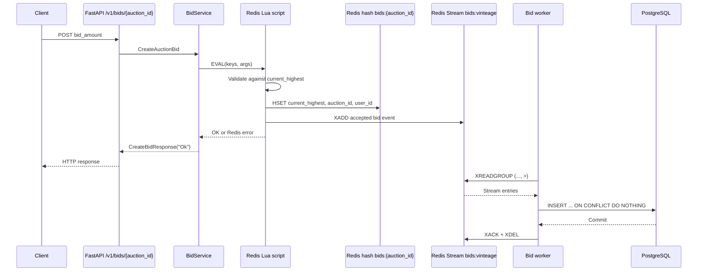

# Auction Bidding Flow

This document describes how a bid travels through the API, Redis, and PostgreSQL in the current implementation.

## Architecture at a glance

A bid has two stages:

1. **Fast acceptance in Redis:** the API executes one Lua script that validates the amount, updates the auction's current highest bid, and appends an event to a Redis Stream.
2. **Asynchronous persistence:** a worker consumes the stream through a Redis consumer group and inserts the accepted bid into PostgreSQL.

The API response means that Redis accepted the bid. It does not mean that the PostgreSQL insert has completed.



## Request path

The endpoint is `POST /v1/bids/{auction_id}`. The route:

1. Authenticates the caller through `CurrentUser`.
2. Reads `bid_amount` from the request body.
3. Builds `CreateAuctionBid` with the amount, authenticated user ID, and path auction ID.
4. Calls `BidService.create_bid`.

`BidService.create_bid` delegates directly to `BidEnqueue.publish_bid`; it does not open a PostgreSQL transaction for the request.

The enqueue operation uses these Redis names:

| Item | Value |
| --- | --- |
| Current-bid hash | `bids:{auction_id}` |
| Highest-bid field | `current_highest` |
| Auction ID field | `auction_id` |
| User ID field | `user_id` |
| Stream | `bids:vinteage` |

The `auctions:{auction_id}` constant exists in the enqueue module, but the current bid path does not read or write that key.

## Atomic contention handling

The Lua script is executed by Redis as one atomic operation. Redis does not interleave another command while the script is running. This is the key contention-control mechanism: two requests competing for the same auction cannot both read the same old highest bid and then overwrite each other independently.

For an auction with current highest bid `100`, the script applies the following rules:

- The first bid for the auction is accepted because no `current_highest` field exists.
- Later bids must satisfy `current_highest + 1 <= bid_amount <= current_highest + 100`.
- A bid below the minimum increment is rejected.
- A bid more than 100 above the current highest is rejected.
- An accepted bid updates the hash and appends the stream event before the script returns.

For concurrent bids, Redis serializes the scripts. The script that runs first establishes the new current value; the next script reads that new value and validates against it. Therefore, an amount that was valid against an earlier value can be rejected if another accepted bid wins the race first.

Example:

- Current value: `100`
- Request A: `150`
- Request B: `180`
- A runs first: `150` is valid and becomes current.
- B then validates against `150`: `180` is valid because it is within `151..250`.

If Request B were `100`, it would be rejected after Request A commits the new value, even if both requests arrived at approximately the same time.

The script returns a Redis error reply for invalid numeric input or an unacceptable amount. Those failures prevent both the hash update and stream append for that invocation.

## Redis hash: current auction state

Each auction has one hash at `bids:{auction_id}`. The script stores the current snapshot as fields:

```text
HGETALL bids:<auction-id>

current_highest 150
auction_id      <auction-id>
user_id         <winning-user-id>
```

The hash is the low-latency source for the current highest bid and winner. It is updated only for accepted bids. The current implementation does not set a TTL, so the hash remains until another component deletes it or Redis data is removed.

The `auction_id` and `user_id` values are stored alongside `current_highest` in every accepted update. They are also copied into the stream event so the asynchronous worker does not need to read the hash later. This is important: the stream entry represents the accepted bid at that point in time, while the hash represents the latest state and may already contain a newer bid when the worker processes the entry.

## Redis Stream: asynchronous write queue

Every accepted bid is appended to `bids:vinteage` with `XADD`:

```text
XADD bids:vinteage MAXLEN ~ 1000 * \
  current_highest 150 \
  auction_id <auction-id> \
  user_id <user-id>
```

Redis generates a stream ID in the form `<timestamp>-<sequence>`, for example `1720000000000-0`. The worker maps these two components to PostgreSQL columns:

| Stream value | PostgreSQL value |
| --- | --- |
| Stream ID timestamp | `bid_ts` |
| Stream ID sequence | `bid_seq` |
| `current_highest` | `amount` |
| `auction_id` | `auction_id` |
| `user_id` | `user_id` |

`MAXLEN ~ 1000` requests approximate trimming. This bounds the stream to roughly 1,000 entries, but it also means the stream is a short-lived transport buffer rather than the permanent bid history. PostgreSQL is the durable history after the worker commits an entry.

Because the hash is updated before the stream event is appended inside the same Lua script, Redis cannot expose an accepted result where only one of those two operations succeeded within that script invocation.

## Worker and consumer group

The worker initializes the `vintage_db_sync` consumer group on `bids:vinteage`, starting at stream ID `0` when the group is first created. Worker consumers are named from their worker ID.

The normal read uses:

```text
XREADGROUP GROUP vintage_db_sync <consumer-name> COUNT 100 BLOCK 2000 STREAMS bids:vinteage >
```

The `>` marker asks Redis for entries that have not yet been delivered to any consumer in this group. Redis tracks delivered but unacknowledged entries in the group's Pending Entries List (PEL).

For each batch, the worker:

1. Converts stream IDs and fields into database records.
2. Inserts the records into `bids`.
3. Commits the PostgreSQL transaction.
4. Acknowledges and deletes the stream entries.

The PostgreSQL insert uses `ON CONFLICT DO NOTHING` on `(bid_seq, bid_ts)`. This makes reprocessing the same stream ID harmless at the database layer, provided the stream entry is still available.

## Failure and retry behavior

The intended reliability boundary is the database commit:

- If parsing or the database transaction fails, the worker must not acknowledge the entry. It remains pending and can be retried.
- On startup, a worker first reads pending entries previously assigned to its own consumer name.
- `XAUTOCLAIM` is used to transfer entries idle for at least 60 seconds from dead or stalled consumers.
- Only after a successful commit should the entry be acknowledged and deleted.

There is an implementation issue to resolve before relying on this behavior: `process_batch` currently calls `redis._client.xackdel(...)`, but `xackdel` is defined on the application's `RedisClient` wrapper, not on the underlying `redis.asyncio.Redis` object. The intended call is the wrapper helper, with the message IDs passed in the helper's expected shape. Until this is corrected and tested, database rows may be committed while stream entries remain pending, causing repeated processing and noisy worker errors. The database uniqueness constraint prevents duplicate rows, but it does not fix failed acknowledgments or guarantee stream retention.

## Consistency model

The design intentionally provides different read latencies:

- **Current winner:** read Redis hash `bids:{auction_id}` for the latest accepted value.
- **Bid history:** read PostgreSQL after the worker has persisted the stream entries.
- **Immediately after an API success:** the latest bid is guaranteed to be in Redis, but it may not yet appear in the PostgreSQL history endpoint.

The Redis hash and stream write are atomic with respect to competing bid requests. Redis-to-PostgreSQL replication is asynchronous and therefore eventually consistent.

## Operational checks

Useful checks while debugging a running environment:

```text
# Current highest bid and winner
HGETALL bids:<auction-id>

# Recent accepted events
XRANGE bids:vinteage - + COUNT 20

# Consumer group and pending-entry statistics
XINFO GROUPS bids:vinteage
XPENDING bids:vinteage vintage_db_sync
```

When diagnosing a missing database bid, compare the Redis hash, stream entry, consumer group's pending entries, and the worker logs in that order. A current hash value alone does not prove that the corresponding historical row has been committed to PostgreSQL.

## Related implementation files

- `app/api/v1/bid.py`: HTTP bid endpoint.
- `app/services/bid/service.py`: service boundary.
- `app/services/bid/enqueue_bid.py`: atomic Lua validation, hash update, and `XADD`.
- `app/jobs/workers/bid_loop.py`: consumer group, batch conversion, PostgreSQL insert, retry/claim flow.
- `app/models.py`: PostgreSQL `Bid` model and `(bid_ts, bid_seq)` uniqueness constraint.
- `app/jobs/workers/__main__.py`: worker process startup.
