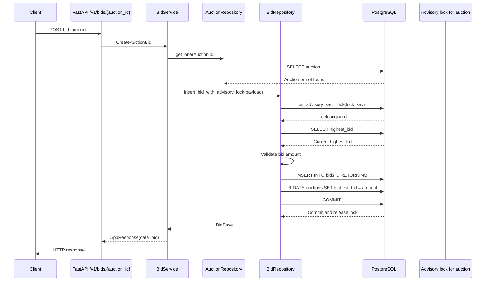

# Auction Bidding Flow with PostgreSQL Locks

This document describes the PostgreSQL-backed bidding flow currently used by the application. Unlike the Redis Stream design documented in `BIDDING_FLOW.md`, the request performs validation, bid insertion, highest-bid update, and commit synchronously inside PostgreSQL.

## Architecture at a glance

The active implementation uses a transaction-level PostgreSQL advisory lock for each auction:

1. The API receives an authenticated bid request.
2. `BidService` verifies that the auction exists.
3. `BidRepository.insert_bid_with_advisory_lock` acquires an advisory lock derived from the auction ID.
4. The repository reads the latest `auctions.highest_bid` while the lock is held.
5. It validates the amount, inserts a row into `bids`, updates the cached highest bid, and commits.
6. PostgreSQL releases the advisory lock automatically when the transaction commits or rolls back.

The response is returned only after the PostgreSQL transaction has committed.



## Request path

The endpoint is `POST /v1/bids/{auction_id}`. The route:

1. Authenticates the caller through `CurrentUser`.
2. Reads `bid_amount` from the request body.
3. Combines the body amount with the authenticated user's ID and the auction path ID in `CreateAuctionBid`.
4. Calls `BidService.create_bid`.

`BidService` creates an `AuctionRepository` and a `BidRepository` using the same `AsyncSession`. It first calls:

```python
await self._auction_repo.get_one([Auction.id == payload.auction_id])
```

This gives a clear not-found response before the write path begins. It then delegates to:

```python
await self._bid_repo.insert_bid_with_advisory_lock(payload)
```

The PostgreSQL session is configured with `autocommit=False`, so the repository controls the transaction and explicitly commits the successful bid.

## Database state

The flow uses two related tables:

### `auctions`

The auction row stores the current cached value in `highest_bid`:

```text
auctions
  id            UUID primary key
  highest_bid   float nullable
```

### `bids`

Each accepted request creates a historical bid row:

```text
bids
  id          UUID primary key
  amount      float
  auction_id  UUID foreign key -> auctions.id
  user_id     UUID foreign key -> users.id
  bid_seq     BIGINT identity, unique
  created_at  timestamp
```

`highest_bid` is the fast current-state lookup. The `bids` table is the durable history. Both are changed in the same transaction, so a successful response corresponds to both changes being committed together.

## Active contention strategy: transaction-level advisory lock

The active method converts the auction UUID into a deterministic lock key:

```python
lock_key = self.uuid_to_lock_id(uuid.UUID(payload.auction_id))
await self.session.execute(select(func.pg_advisory_xact_lock(lock_key)))
```

`pg_advisory_xact_lock` is a transaction-level advisory lock. It has these properties:

- It is independent of a particular table row.
- It blocks another transaction requesting the same lock key.
- It does not block transactions using a different auction key.
- It is automatically released on commit or rollback.
- The blocking request waits rather than immediately failing.

The lock serializes the read-check-write sequence for one auction. Without it, two transactions could both read the same old `highest_bid`, both pass validation, and then overwrite the cached value in a race.

### Lock scope

The lock key is derived from the auction ID, so requests for the same auction contend with one another while requests for different auctions can proceed independently:

```text
Auction A -> lock key A -> serialized with other Auction A bids
Auction B -> lock key B -> independent from Auction A
```

The current helper uses `zlib.crc32(uuid.bytes)`. Despite the method docstring describing a 64-bit key, CRC32 produces a 32-bit integer. This is deterministic, but it introduces a theoretical hash-collision risk: two different auction UUIDs could map to the same advisory-lock key and unnecessarily block one another. A collision would affect concurrency, not bid ownership or data isolation, because the SQL predicates still use the real UUID.

## Active write sequence

`insert_bid_with_advisory_lock` performs these operations in order.

### 1. Acquire the lock

The transaction obtains the advisory lock before reading the current highest bid. Any competing bid for the same derived key waits here.

### 2. Read the current highest bid

The repository executes:

```sql
SELECT COALESCE(highest_bid, 0.0)
FROM auctions
WHERE id = :auction_id;
```

A row lock is not needed for this read because the advisory lock provides application-level serialization for requests that use this method.

### 3. Validate the amount

The active advisory-lock method currently checks only the minimum increment:

```text
bid_amount >= current_highest + 1.0
```

If the amount is too low, it rolls back and returns `None`. The rollback releases the advisory lock.

Unlike `insert_bid`, the active method does not currently enforce the upper bound of `current_highest + 100.0`. That upper-bound rule exists in the row-lock implementation, but not in the selected advisory-lock implementation. If the business rule requires the same maximum jump in both flows, it should be added to the active method before treating the strategies as behaviorally equivalent.

### 4. Insert the historical bid

The accepted bid is inserted with the requested amount, auction ID, user ID, and `clock_timestamp()`:

```sql
INSERT INTO bids (amount, auction_id, user_id, created_at)
VALUES (:amount, :auction_id, :user_id, clock_timestamp())
RETURNING *;
```

The generated bid is converted to `BidBase` after the transaction succeeds.

### 5. Update the auction snapshot

The repository updates the same auction row:

```sql
UPDATE auctions
SET highest_bid = :bid_amount
WHERE id = :auction_id;
```

The `WHERE` clause uses the UUID supplied by the request. The lock ensures that this update follows a check against the latest value for this auction.

### 6. Commit and release

The repository commits explicitly. PostgreSQL then releases the transaction-level advisory lock. Only after this commit does the service return the accepted bid to the API route.

## Contention example

Assume the current `highest_bid` is `100` and two requests target the same auction:

```text
Request A: 150
Request B: 120
```

A possible execution is:

1. A acquires the auction advisory lock.
2. B requests the same lock and waits.
3. A reads `100`, accepts `150`, inserts its row, updates `highest_bid` to `150`, and commits.
4. PostgreSQL releases A's lock.
5. B acquires the lock and reads the new value `150`.
6. B's `120` is below `151`, so B rolls back and returns `None`.

The result is one accepted bid and one rejected bid. The two requests cannot both validate against the stale value `100`.

For different auctions, the lock keys differ and the transactions do not need to wait for one another.

## Transaction and failure behavior

The repository's successful path is atomic across the bid history and current auction snapshot:

- If the insert fails, the update is not committed.
- If the auction update fails, the inserted bid is rolled back with the transaction.
- If validation fails, the explicit rollback releases the advisory lock.
- If an exception escapes the repository, the database session context rolls back the transaction.
- A successful API response is synchronous with the PostgreSQL commit; there is no Redis Stream delay or eventual-consistency window for the write itself.

The service's initial auction existence check and the repository's later read are separate SQL statements in the same session. The repository's `SELECT` is the authoritative read for the write decision. The advisory lock is acquired after the service's existence check.

## Alternative implementation 1: row-level lock

`insert_bid` uses PostgreSQL's row-level lock instead of an advisory lock:

```python
auction_top_query = (
    select(Auction)
    .where(Auction.id == payload.auction_id)
    .with_for_update()
)
```

This directly locks the matching `auctions` row. Its flow is:

1. Set the local `lock_timeout` to 500 ms.
2. Select the auction with `FOR UPDATE`.
3. Reject if the auction does not exist.
4. Validate both the minimum and maximum allowed amounts.
5. Add the bid to the session.
6. Change `auction.highest_bid`.
7. Commit.

### Row lock tradeoffs

| Property | Row-level lock |
| --- | --- |
| Lock identity | Physical `auctions` row |
| Database visibility | Visible through normal row-lock tooling |
| Missing auction | Naturally returns no row from the locked query |
| Timeout | Explicit 500 ms local timeout |
| Coupling | Tied to the auction table row |
| Business validation | Includes minimum and maximum bounds |

This option is often easier to reason about because the row being read and updated is also the row being locked. It also makes lock ownership more directly connected to the auction record.

## Alternative implementation 2: one SQL statement with a locked CTE

`insert_bid_by_sql_check` attempts to keep the lock, validation, and insert close to one SQL statement:

1. A CTE selects the auction with `FOR UPDATE`.
2. The payload is selected from that locked CTE only when the amount is at least `highest_bid + 1`.
3. An `INSERT ... FROM SELECT` creates the bid and returns it.
4. The auction snapshot is updated.
5. The transaction commits.

Conceptually, the guarded insert is:

```sql
WITH locked_auction AS (
    SELECT *
    FROM auctions
    WHERE id = :auction_id
    FOR UPDATE
)
INSERT INTO bids (amount, auction_id, user_id, created_at)
SELECT :amount, :auction_id, :user_id, clock_timestamp()
FROM locked_auction
WHERE :amount >= COALESCE(locked_auction.highest_bid, 0) + 1
RETURNING *;
```

This option reduces the application-level gap between reading and inserting. The current implementation still performs the auction update and commit afterward, and it checks only the minimum increment like the advisory-lock method.

## Comparing the three repository methods

| Method | Lock mechanism | Validation | Main benefit | Important note |
| --- | --- | --- | --- | --- |
| `insert_bid_with_advisory_lock` | Transaction advisory lock | Minimum increment only | Explicit per-auction application lock | Active service path; CRC32 key is 32-bit despite the docstring |
| `insert_bid` | `SELECT ... FOR UPDATE` | Minimum and maximum bounds | Directly locks the auction row | Uses a 500 ms local lock timeout |
| `insert_bid_by_sql_check` | Locked CTE with row lock | Minimum increment only | Combines lock and guarded insert in SQL | Auction update and commit remain separate statements |

Only `insert_bid_with_advisory_lock` is currently selected by `BidService.create_bid`.

## Correctness considerations

### Keep validation rules consistent

The repository methods do not currently enforce identical rules. The active advisory-lock method allows any bid at least one unit above the current value, while `insert_bid` limits the amount to a range ending 100 units above the current value. A shared validation rule would prevent behavior from changing when the repository strategy changes.

### Use an integer or exact monetary type

`bid_amount` is accepted as an integer, but `highest_bid` and `Bid.amount` are PostgreSQL floating-point values. For currency, a fixed-precision `NUMERIC`/`Decimal` representation is safer than floating-point arithmetic.

### Handle rejected bids explicitly

The active method returns `None` when the bid is below the minimum. The route wraps the result in `AppResponse` without converting that result into a clear HTTP error. The API contract should define whether an invalid bid returns a validation error, a conflict response, or an empty data value.

### Keep the lock-key function stable

All writers for this flow must use the same lock-key derivation. Changing the hash function or key format while old workers are running could allow different code paths to acquire different locks for the same auction.

## Operational checks

Useful PostgreSQL checks include:

```sql
-- Current cached highest bid
SELECT id, highest_bid
FROM auctions
WHERE id = '<auction-id>';

-- Bid history for one auction
SELECT id, amount, auction_id, user_id, bid_seq, created_at
FROM bids
WHERE auction_id = '<auction-id>'
ORDER BY bid_seq DESC;

-- Active sessions waiting on locks
SELECT pid, wait_event_type, wait_event, state, query
FROM pg_stat_activity
WHERE wait_event_type = 'Lock';

-- Lock information for advisory locks
SELECT pid, granted, classid, objid, objsubid
FROM pg_locks
WHERE locktype = 'advisory';
```

When investigating contention, first check whether multiple sessions are waiting on the same advisory key, then compare `auctions.highest_bid` with the most recent `bids.amount`. Both should agree after a successful transaction.

## Related implementation files

- `app/api/v1/bid.py`: HTTP bid endpoint.
- `app/services/bid/service.py`: auction existence check and active repository selection.
- `app/repositories/bid_repository.py`: advisory-lock, row-lock, and locked-CTE implementations.
- `app/repositories/auction_repository.py`: auction lookup repository.
- `app/models.py`: `Auction.highest_bid` and `Bid` database models.
- `app/core/database/session.py`: async session and transaction lifecycle.
- `migrations/versions/3ba6235fea06_init_models.py`: initial auction and bid schema.
